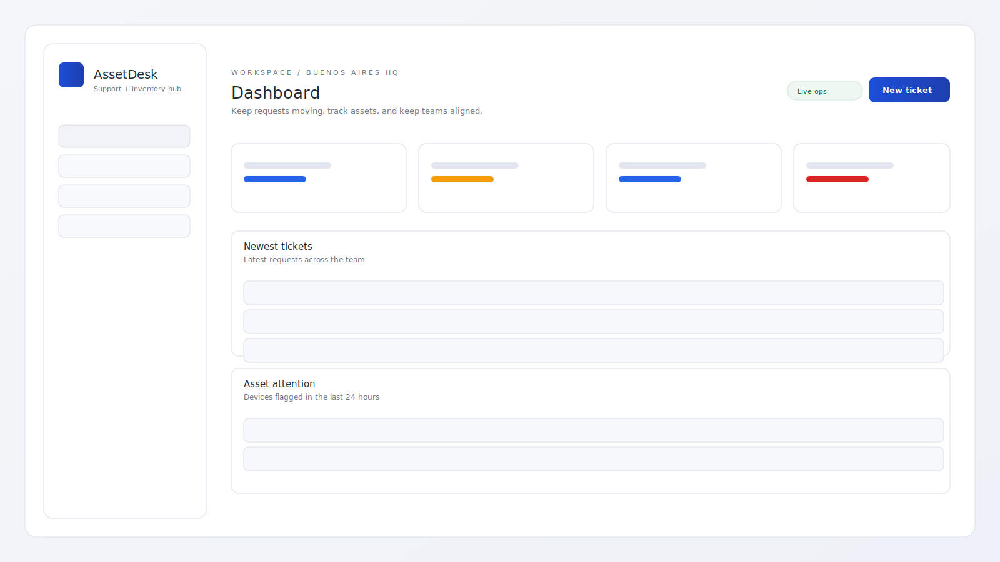
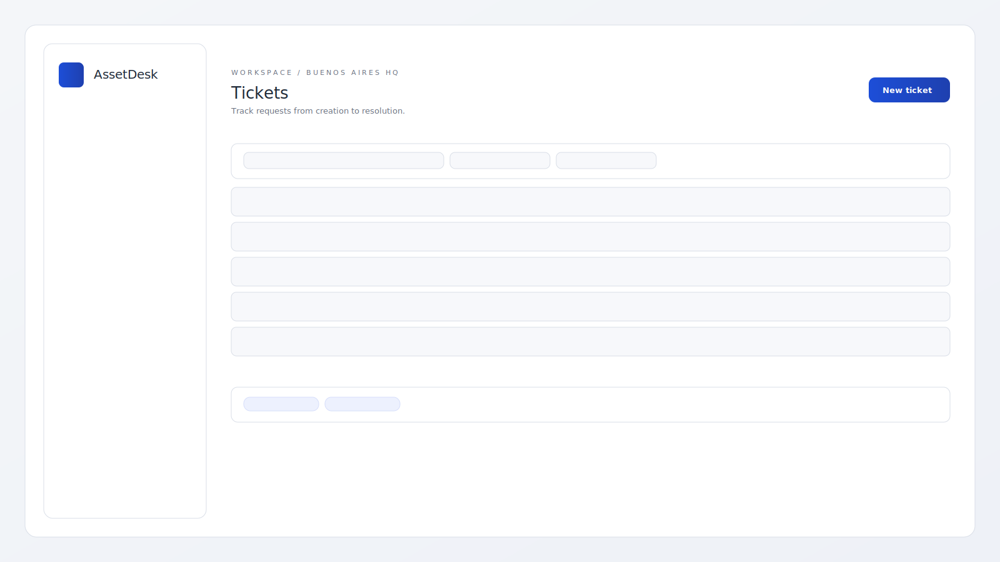

# AssetDesk

AssetDesk is an enterprise-grade service desk and asset inventory platform. It consolidates ticket operations, device health, and field workflows into a unified workspace built for IT organizations.

## Capabilities
- Role-based access with JWT authentication
- Ticket workflows with priority, status, and ownership
- Asset inventory with health states, locations, and assignment
- People directory for service desk and field teams
- Operational dashboard with executive summary metrics

## Technology
- Frontend: React + Vite
- Backend: Node.js + Express
- Database: SQLite (swap-in ready for PostgreSQL)
- Authentication: JWT

## Architecture
```
React UI -> Express API -> SQLite
```

## Screens



## Local Setup

### Backend
```
cd backend
npm install
cp .env.example .env
npm run seed
npm run dev
```

API: `http://localhost:4000`

### Frontend
```
cd frontend
npm install
npm run dev
```

Frontend: `http://localhost:5173`

### Demo Access
- Email: `demo@assetdesk.dev`
- Password: `demo123`

## Notes
- Update `CORS_ORIGIN` in `backend/.env` if the frontend URL changes.
- To use PostgreSQL, replace the SQLite layer in `backend/src/db.js` with a Postgres client.
