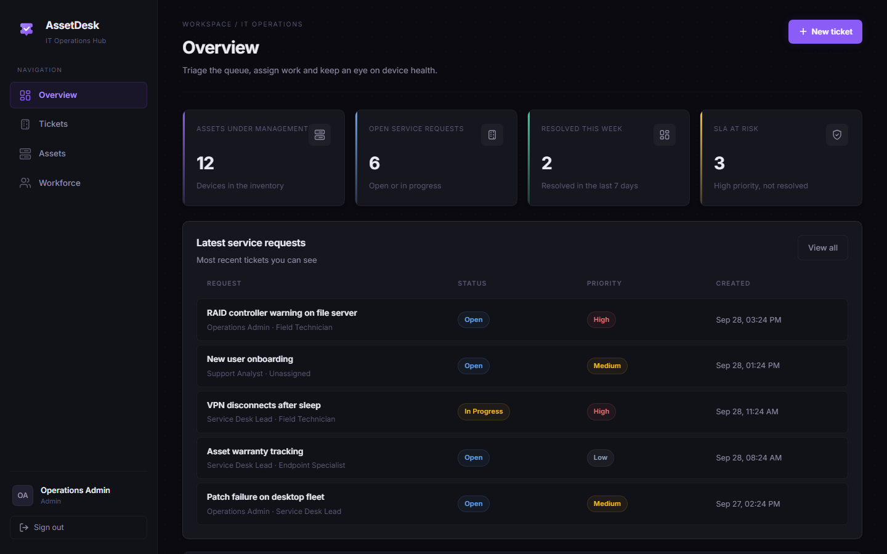
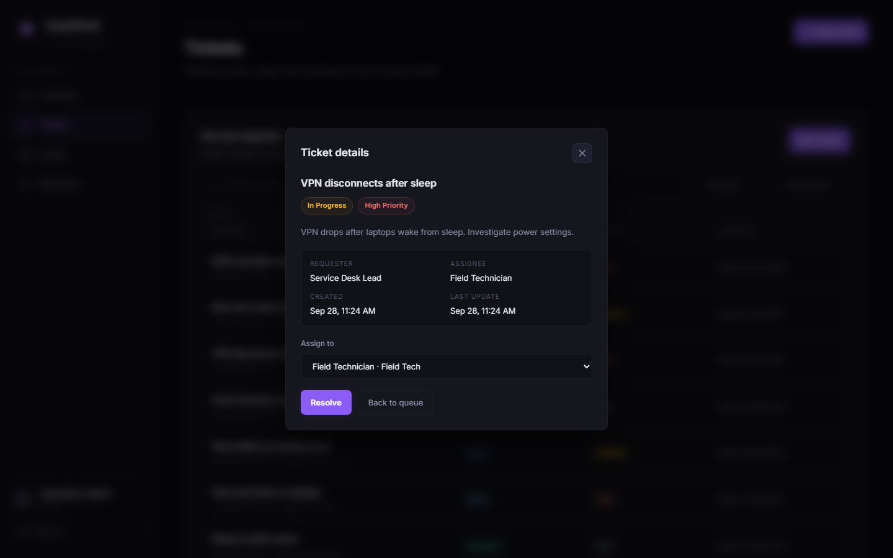
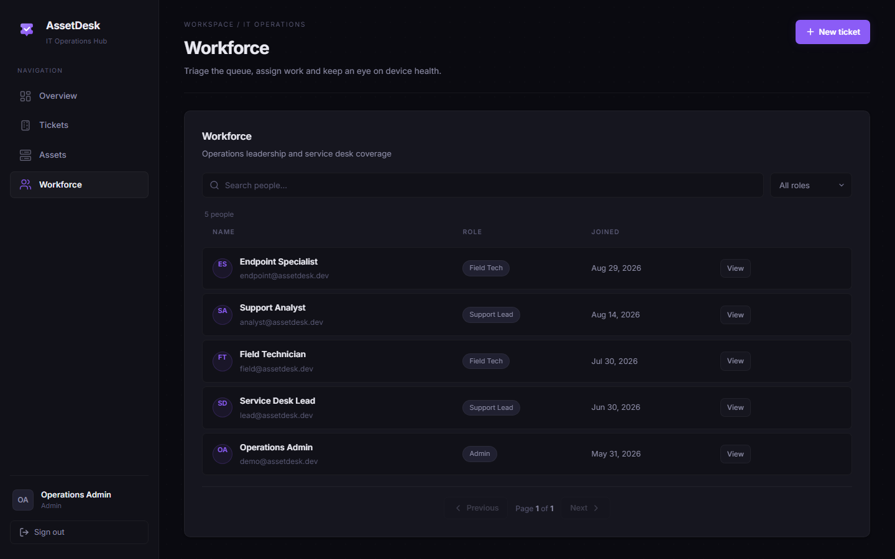
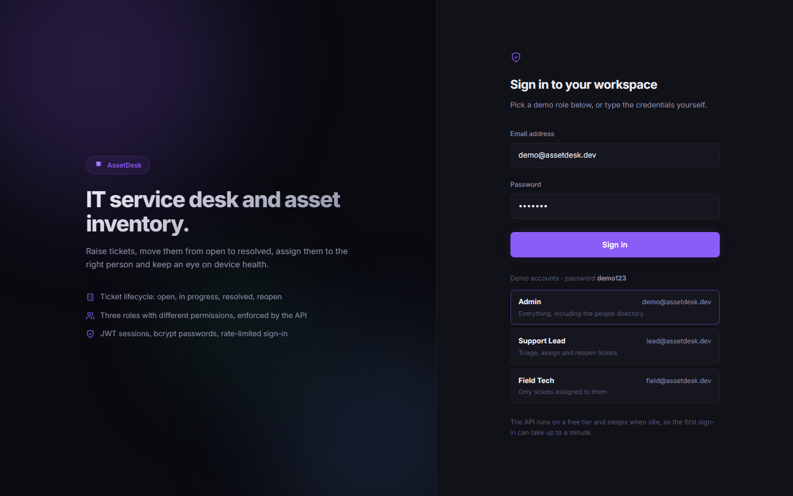

# AssetDesk

[](https://github.com/JimmyAlter/AssetDesk/actions/workflows/ci.yml)

A small IT service desk and asset inventory. People raise tickets, managers assign them, technicians move them from open to resolved, and a dashboard summarises the queue and device health. React frontend, Express + SQLite API, JWT auth with role-based access enforced on the server.

**Live demo:** [assetdesk-demo.vercel.app](https://assetdesk-demo.vercel.app). The API runs on Render's free tier, so the first request after it has been idle can take up to a minute.

| Role | Email | Password |
|---|---|---|
| Admin | `demo@assetdesk.dev` | `demo123` |
| Support Lead | `lead@assetdesk.dev` | `demo123` |
| Field Tech | `field@assetdesk.dev` | `demo123` |

The sign-in page has one-click buttons for each role. Demo data is shared by everyone using the demo and resets to the seed whenever the API restarts or is redeployed.

| Overview | Ticket detail |
|---|---|
|  |  |
| **Workforce (managers only)** | **Sign in** |
|  |  |

Screenshots are taken from the current code running locally against the seed data.

## Features

- Email and password sign-in (bcrypt hashes, 8-hour HS256 JWT, rate-limited login)
- Tickets with title, priority and description; the requester is taken from the token
- Ticket lifecycle `open → in_progress → resolved`, with "back to queue" and reopen, and a `resolved_at` timestamp
- Assignment to any user, by Admins and Support Leads
- Asset inventory with health states, and a people directory
- Dashboard counts: assets, open tickets (open or in progress), tickets resolved in the last 7 days, and unresolved high-priority tickets
- Search, filters and pagination on every list

## Roles and permissions

Roles are checked by the API on every request (`requireRole` middleware and per-ticket checks in `backend/src/server.js`). The UI hides controls a role can't use, but it is not what enforces the rules. The user's role is re-read from the database on each request, so a role change applies straight away.

| Action | Admin | Support Lead | Field Tech |
|---|:---:|:---:|:---:|
| View dashboard counts (organisation-wide) | ✓ | ✓ | ✓ |
| View assets | ✓ | ✓ | ✓ |
| Create a ticket | ✓ | ✓ | ✓ |
| List tickets | all | all | assigned to them or raised by them |
| Start, resolve or return a ticket to the queue | any ticket | any ticket | only tickets assigned to them |
| Reopen a resolved ticket | ✓ | ✓ | ✗ (403) |
| Assign or unassign a ticket | ✓ | ✓ | ✗ (403) |
| View the people directory (`GET /api/users`) | ✓ | ✓ | ✗ (403) |

Field Techs get `404` for tickets they cannot see, and `403` when they try to change a ticket they can see but is not assigned to them.

### Ticket states

```text
open ──start──► in_progress ──resolve──► resolved
  ▲                 │                        │
  └──back to queue──┘                        │
  ▲                                          │
  └──────────── reopen (managers only) ──────┘
```

Any other transition returns `409 Conflict`. Resolving sets `resolved_at`; reopening clears it.

## Architecture

```text
React 19 + Vite (Vercel)  ──HTTPS/JSON──►  Express API (Render)  ──►  SQLite (better-sqlite3)
```

```text
backend/
  src/server.js    Express app: auth, requireRole, routes, error handling
  src/roles.js     Role names and the ticket state machine
  src/db.js        Schema, migration from the old schema, demo seed
  test/            node:test suites (API, RBAC, lifecycle, hardening, migration)
frontend/
  src/api.js       fetch wrapper (auth header, error messages)
  src/permissions.js  UI mirror of the role rules
  src/components/  Dashboard, Tickets, TicketDetail, Assets, Users, Login
```

Tickets store `requester_id` and `assignee_id` as user ids. Databases created by earlier versions (names stored as text) are migrated in place on startup.

## API

All routes except health and login need `Authorization: Bearer <token>`. Errors are JSON: `{ "error": "message" }`.

| Method | Path | Who | Notes |
|---|---|---|---|
| GET | `/api/health` | public | `{ status: "ok" }` |
| POST | `/api/auth/login` | public | `{ email, password }` → `{ token, user }`; 20 attempts/min per client |
| GET | `/api/me` | any role | the signed-in user |
| GET | `/api/summary` | any role | dashboard counts |
| GET | `/api/tickets` | any role | scoped for Field Techs, see above |
| POST | `/api/tickets` | any role | `{ title, priority?, description? }` |
| PATCH | `/api/tickets/:id` | see table | `{ status?, assigneeId? }` (`assigneeId` is a user id or `null`) |
| GET | `/api/assets` | any role | |
| GET | `/api/users` | Admin, Support Lead | never includes password hashes |

## Running it locally

Requires Node.js 20 or later.

```bash
cd backend
cp .env.example .env
npm ci
npm start            # http://localhost:4000, creates and seeds the database on first run

cd ../frontend
npm ci
npm run dev          # http://localhost:5173
```

The frontend calls `VITE_API_URL`, defaulting to `http://localhost:4000`. Backend settings are documented in [`backend/.env.example`](backend/.env.example). To start from a clean seed, delete `backend/data/assetdesk.db`.

## Tests and CI

```bash
cd backend && npm test      # 38 node:test cases against a throwaway SQLite file
cd frontend && npm test     # 9 Vitest cases
```

The backend suites cover:

- every data route returning 401 without a valid bearer token (missing, wrong scheme, forged, wrong algorithm, `alg: none`, deleted user)
- 403 for every role-gated action, and Field Techs only seeing their own tickets
- the ticket state machine, `resolved_at` and the "resolved this week" count
- login input type checks and identical errors for unknown email and wrong password
- JSON 404, malformed JSON (400), oversized bodies (413), generic 500s, CORS rejection (403) and localhost only outside production
- per-client rate limiting behind a trusted proxy, and that `X-Forwarded-For` is ignored without one
- migration of databases created with the old schema

The frontend tests cover the API client (including a regression test for the header merge bug that broke ticket creation) and the permission helpers.

GitHub Actions runs the backend tests on Node 20 and 22, and the frontend lint, tests and build, on every push and pull request. Dependabot checks npm and Actions dependencies weekly.

## Security notes

- Passwords are bcrypt hashes. Login compares against a dummy hash when the email is unknown, and returns the same error either way.
- JWTs are signed and verified with HS256 only, and must be sent with the `Bearer` scheme. With `NODE_ENV=production` the server exits at startup if `JWT_SECRET` is missing or still the development default.
- All queries are prepared statements with `?` placeholders.
- `helmet` sets security headers. JSON bodies are capped at 200 KB.
- CORS allows the origins in `CORS_ORIGIN`; `http://localhost` and `http://127.0.0.1` are allowed only outside production.
- `TRUST_PROXY` (default `1` in production) makes the login rate limit apply per client behind Render's proxy.
- Unexpected errors return `{ "error": "Internal server error" }` without stack traces.

See [SECURITY.md](SECURITY.md) for how to report a vulnerability.

## Deployment

`render.yaml` defines the API as a Render free web service. Free services have no persistent disk, so the SQLite file lives on the instance's ephemeral filesystem: it is created and seeded on startup and **reset on every redeploy or restart**, which is fine for a demo. The frontend is a static Vite build on Vercel with `VITE_API_URL` pointing at the API.

## Limitations

- SQLite on one instance. For real traffic or more than one instance, move to PostgreSQL; the data layer is in `backend/src/db.js`.
- No user management UI or self-service sign-up; users come from the seed.
- No ticket comments, status history or audit trail.
- The JWT lives in `localStorage`, and there is no refresh token or server-side revocation list (a deleted user's token stops working because the user is looked up on every request).
- The rate limiter's store is in memory, so limits reset on restart and are not shared between instances.
- No end-to-end tests in CI; the UI flows were checked manually with Playwright against a local build.

## License

MIT. See [LICENSE](LICENSE).
